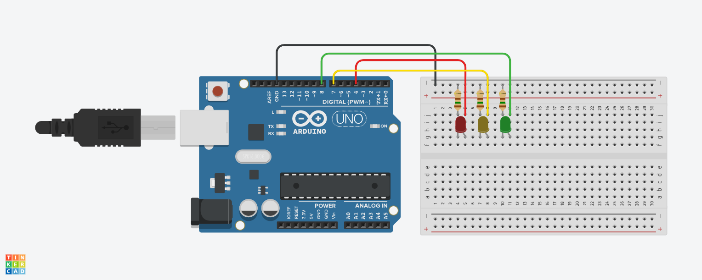

# Arduino Traffic Light System
This project is a simple traffic light system built using an Arduino board and three LEDs. The system simulates a traffic light by displaying a green light first, followed by a yellow light that flashes three times, and then a red light. This cycle repeats indefinitely.

# Hardware Requirements
- Arduino board (Uno, Nano, or similar)
- Three LEDs (green, yellow, and red)
- Three 220 ohm resistors
- Breadboard or PCB for prototyping
- Jumper wires
# Software Requirements
- Arduino IDE (or similar software for uploading code to the Arduino board)
# How to Use
1. Connect the LEDs and resistors to the Arduino board as shown in the schematic (included in the repository). 
2. Open the Arduino IDE and upload the code to the board.
3. Power on the board and the traffic light system will begin cycling through the green, yellow, and red lights.
# Video
- Check the following vedio to see the project simulation [video](https://drive.google.com/file/d/1JAXSx2FuTB9KoRWsa8ozFrDdgKFLmJ1_/view)
# Tinkercad
- You can view a live simulaton of the project through the following link on [Tinkercad](https://www.tinkercad.com/things/hV4TmmGCnOU-traffic-light-system)
# Contributing
Contributions to this project are welcome! If you find a bug or have an idea for a new feature, please open an issue or submit a pull request.

# License
This project is licensed under the MIT license. Feel free to use and modify the code as needed.
